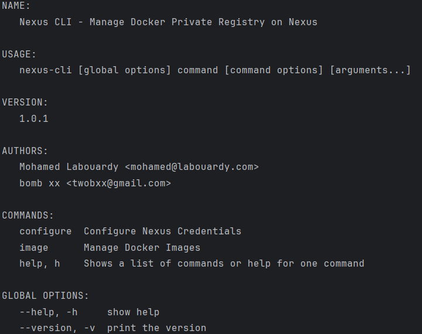

[](https://circleci.com/gh/mlabouardy/nexus-cli) [](LICENSE)

<div align="center">

</div>
Nexus Docker 客户端 

## 说明
本仓库基于 [源仓库](https://github.com/mlabouardy/nexus-cli) 做出的修改部分, 新增了基于内部规则的清理


## 使用说明

<div align="center">

</div>

## 构建
```shell
# 初始化项目
go mod init nexus-cli
# 拉取依赖
go mod tidy
# 编译客户端 -o 为指定输出的客户端文件名称和路径
go build -o nexus-cli .
```

## 下载

## 命令说明
```bash
# 所有命令均可使用 help | -h |--help 获取帮助信息
nexus-cli -h
```

```bash
# 配置仓库相关
nexus-cli configure
```

```bash
nexus-cli image ls
```

```bash
nexus-cli image tags -name mlabouardy/nginx
```

```bash
nexus-cli image info -name mlabouardy/nginx -tag 1.2.0
```

```bash
# 删除指定镜像的tag
nexus-cli image delete -name mlabouardy/nginx -tag 1.2.0
```

```bash
# 按照规则删除镜像, 保留 4 个
nexus-cli image delete -name mlabouardy/nginx -keep 4
```

```bash
# 按照 SZIS 的规则删除镜像, -k 为保留多少个数量
nexus-cli image szis delete -name mlabouardy/nginx -k 2
```

```bash
nexus-cli image size -name mlabouardy/nginx
```
## 使用介绍(该博文发布于2021年, 其部分命令资源已无法获取, 可通过本仓库编译后获取资源)

* [Cleanup old Docker images from Nexus Repository](http://www.blog.labouardy.com/cleanup-old-docker-images-from-nexus-repository/)
